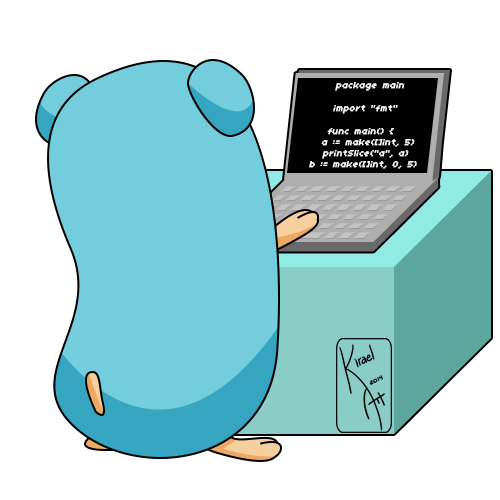

# fly-with-go

🐹 go is the language I want to 🛶 conquer next 🌍.

<p>
  
  
  
  
</p>

> **🦄 why Go?**

> I have been using Node for a long time. Node is best but not perfect. Go will be a good complement to Node's weaknesses. You can read [this article](https://medium.com/@kevalpatel2106/why-should-you-learn-go-f607681fad65) to understand why I choose to Go.

<h2 id="home">🏷️ contents</h2>

- #### [🛴 basic](#basic)

  - ##### [🖨️ printing](#printing)

  - ##### [🔫 function](#function)

  - ##### [🌳 variable](#variable)

  - ##### [🥚 basic types](#basic-types)

  - ##### [🚂 type conversion](#type-conversion)

  - ##### [🍭 loop](#loop)

  - ##### [👻 conditional statement](#conditional-statement)

  - ##### [🎣 defer](#defer)

  - ##### [🏹 pointer](#pointer)

  - ##### [📦 struct](#struct)

	- ##### [🚥 array](#array)

	- ##### [🎢 slices](#slices)

- #### [🚀 advanced](#advanced)

- #### [📙 documents](#documents)

- #### [🚧 license](#license)

<h2 id="basic">🛴 basic</h2>

<h3 id="printing">🖨️ printing</h3>

```go
package main

import (
  "fmt"
  "math"
)

func main() {
  fmt.Println("Hello %s", "🐹 Go")
  fmt.Println(math.Pi)
}
```

**[⬆️ back to top](#home)**

<h3 id="function">🔫 function</h3>

```go
package main

import "fmt"

func add(a int, b int) int {
  return a + b
}

func subtract(a, b int) int {
  return a - b
}

func swap(a, b int) (int, int) {
  return b, a
}

// named return values
func split(number int) (a, b int) {
	a = number / 10
	b = number % 10
	return
}

func main() {
  fmt.Println(add(6,9)) // 15
  fmt.Println(subtract(17, 10)) // 7
  a, b := swap(10, 17)
  fmt.Println(a, b) // 17 10
  fmt.Println(split(19)) // 1 9
}
```

**[⬆️ back to top](#home)**

<h3 id="variable">🌳 variable</h3>

```go
package main

import "fmt"

// global variables
var canFly bool
var age int = 21

func main() {
  // explict
  var name string = "Cuong Duy Tran Nguyen"
  // inferred
  var job, address = "Software Engineer", "Ho Chi Minh city"
  // shorthand
  gender := "male"
  // constant
  const homeTown = "Tam Ky city, Quang Nam province"
	fmt.Println(canFly, name, age, job, address, gender, homeTown)
}
```

**[⬆️ back to top](#home)**

<h3 id="basic-types">🥚 basic types</h3>

```
bool

string

int  int8  int16  int32  int64
uint uint8 uint16 uint32 uint64 uintptr

byte // alias for uint8

rune // alias for int32
     // represents a Unicode code point

float32 float64

complex64 complex128
```

```go
package main

import "fmt"

func main() {
	var (
		name string = "Cuong Duy Nguyen"
		age int = 21
	)
	fmt.Printf("type: %T, value: %v\n", name, name)
	fmt.Printf("type: %T, value: %v\n", age, age)
}
```

**[⬆️ back to top](#home)**

<h3 id="type-conversion">🚂 type conversion</h3>

```go
package main

import (
	"fmt"
	"math"
)

func main() {
	var z uint = uint(math.Sqrt(64))
	var i int = 7
	var f float64 = float64(i)
	fmt.Print(z, i, f)
}
```

**[⬆️ back to top](#home)**

<h3 id="loop">🍭 loop</h3>

```go
package main

import "fmt"

func main() {
	for i := 0; i < 7; i++ {
		fmt.Println(i)
  }
  // for continued
  max := 0
	for ; max < 7777 ; {
		max += 7
	}
  fmt.Println(max)
  // while
  sum := 0
	for sum < 777 {
		sum += 7
	}
  fmt.Println(sum)
  // forever
  for {
		fmt.Println("go")
	}
}
```

**[⬆️ back to top](#home)**

<h3 id="conditional-statement">👻 conditional statement</h3>

```go
package main

import (
  "fmt"
  "runtime"
  "time"
)

func compare(x, y int) (z string) {
	if x > y {
		z = "x is greater than y"
	} else {
		z = "x is smaller than y"
	}
	return
}

func isEven(number int) bool {
	if num := number % 2; num == 0 {
		return true
	}
	return false
}

// switch case
func checkOS() string {
	switch os := runtime.GOOS; os {
		case "linux":
			return "🐧 Linux"
		case "darwin":
			return "🌌 macOS"
		default:
			return os
	}
}
// switch case without condition
func showGreeter() string {
	h := time.Now().Hour()
	switch {
		case h < 12:
			return "good morning"
		case h < 17:
			return "good afternoon"
		default:
			return "good evening"
	}
}

func main() {
	t := compare(6, 7)
  fmt.Println(t)
  fmt.Print(isEven(7))
  fmt.Print(checkOS())
  fmt.Println(showGreeter())
}
```

**[⬆️ back to top](#home)**

<h3 id="defer">🎣 defer</h3>

> A defer statement defers the execution of a function until the surrounding function returns.

> Deferred function calls are pushed onto a stack. When a function returns, its deferred calls are executed in last-in-first-out order.

```go
package main

import "fmt"

func main() {
	fmt.Print("counting ")

	for i := 0; i < 10; i++ {
		defer fmt.Printf("%d ", i)
	}

  fmt.Print("done ")
  // counting done 9 8 7 6 5 4 3 2 1 0
}
```

**[⬆️ back to top](#home)**

<h3 id="pointer">🏹 pointer</h3>

```go
package main

import "fmt"

func main() {
	i, j := 10, 50
	a := &i
	fmt.Println(a, *a)
	*a = 17
	fmt.Println(a, *a, i)
	var b *int = &j
	fmt.Println(b, *b)
	a = b
	fmt.Println(*a, *b)
}
```

**[⬆️ back to top](#home)**

<h3 id="struct">📦 struct</h3>

```go
package main

import "fmt"

type Point struct {
	x int
	y int
}

func main() {
	// basic struct
	p := Point{6, 9}
	fmt.Println(p, p.x, p.y)
	p.x = 1
	p.y = 7
	fmt.Println(p, p.x, p.y)

	// struct with pointer
	var a *Point = &p
	fmt.Println(a, *a)
	fmt.Println(a.x, (*a).x) // the same result

	// init struct
	var (
		v1 = Point{1, 2}  // has type Point
		v2 = Point{x: 1}  // Y:0 is implicit
		v3 = Point{}      // X:0 and Y:0
		k  = &Point{1, 2} // has type *Point
	)
	fmt.Println(v1, k, v2, v3)
}
```

**[⬆️ back to top](#home)**

<h3 id="array">🚥 array</h3>

```go
package main

import "fmt"

func main() {
	var list [7]int
	list[0] = 7
	fmt.Println(list, list[1]) // [7 0 0 0 0 0 0] 0
	
	oddNumbers := [3]int{3, 5}
	oddNumbers[2] = 7
	fmt.Println(oddNumbers) // [3 5 7]
	
	var fullName [3]string = [3]string{"Cuong", "Duy", "Nguyen"}
	fmt.Println(fullName) // [Cuong Duy Nguyen]
}
```

**[⬆️ back to top](#home)**

<h3 id="slices">🎢 slices</h3>

```go
package main

import "fmt"

func main() {
	// 1. basic slice
	a := []int{1, 2, 3, 5, 6, 7, 8 ,9, 10}
	a = a[:7]
	fmt.Println(a) // [1 2 3 5 6 7 8]

	// 2. slices are like references to arrays
	pets := []string{"cat", "dog", "bird", "fish"}
	fmt.Println(pets) // [cat dog bird fish]
	list := pets[0 : 2]
	fmt.Println(list) // [cat dog]
	list[1] = "pig"
	fmt.Println(list) // [cat pig]
	fmt.Println(pets) // [cat pig bird fish]

	// 3. slice length & capacity
	// The capacity of a slice is the number of elements in the underlying array, counting from the first element in the slice.
	s := []int{2, 3, 5, 7, 11, 13}
	fmt.Printf("len=%d cap=%d %v\n", len(s), cap(s), s)
	// len=6 cap=6 [2 3 5 7 11 13]

	// 4. slice the slice to give it zero length.
	s = s[:1]
	fmt.Printf("len=%d cap=%d %v\n", len(s), cap(s), s)
	// len=1 cap=6 [2]

	// Extend its length.
	s = s[:2]
	fmt.Printf("len=%d cap=%d %v\n", len(s), cap(s), s)
	// len=2 cap=6 [2 3]

	// Drop its first two values.
	s = s[2:]
	fmt.Printf("len=%d cap=%d %v\n", len(s), cap(s), s)
	// len=0 cap=4 []
	
	s = s[:4]
	fmt.Printf("len=%d cap=%d %v\n", len(s), cap(s), s)
	// len=4 cap=4 [5 7 11 13]

	// 5. nil slices
	// A nil slice has a length and capacity of 0 and has no underlying array.
	var t []int
	fmt.Println(t, len(t), cap(t)) // [] 0 0
	if t == nil {
		fmt.Println("nil!") // nil!
	}

	// 6. Creating a slice with make
	x := make([]int, 10)
	fmt.Printf("%d %d %v \n", len(x), cap(x), x)
	// 10 10 [0 0 0 0 0 0 0 0 0 0]
	
	y := make([]int, 0, 5)
	fmt.Printf("%d %d %v \n", len(y), cap(y), y)
	// 0 5 []
	
	z := y[:5]
	fmt.Printf("%d %d %v \n", len(z), cap(z), z)
	// 5 5 [0 0 0 0 0]

	// 7. Appending to a slice
	// cap will auto scale up depend on the added elements
	m := []int{}
	fmt.Printf("len=%d cap=%d %v\n", len(m), cap(m), m)
	// len=0 cap=0 []
	
	m = append(m, 6, 5)
	fmt.Printf("len=%d cap=%d %v\n", len(m), cap(m), m)
	// len=2 cap=2 [6 5]
	
	m = append(m, 1, 2, 5, 6, 8, 9, 3)
	fmt.Printf("len=%d cap=%d %v\n", len(m), cap(m), m)
	// len=9 cap=12 [6 5 1 2 5 6 8 9 3]

	// 8. range
	// contain i(index) & v(value)
	var numbers []int = []int{1, 3, 7, 8}
	for i, v := range numbers {
		fmt.Println(i, v)
	}
	/*
	0 1
	1 3
	2 7
	3 8
	/*

	/*
	skip the index or value by assigning to _
	for i, _ := range pow
	for _, value := range pow
	*/

	/*
	only want index
	for i := range pow
	*/
}
```

**[⬆️ back to top](#home)**

<h2 id="advanced">🚀 advanced</h2>

<h2 id="documents">📙 documents</h2>

- #### 🦊 [golang.org](https://golang.org/)

- #### 🦌 [A Tour of Go](https://tour.golang.org)

- #### 🐧 [Golang for Node.js Developers](https://github.com/miguelmota/golang-for-nodejs-developers)

- #### 🐠 [Golang Tutorial  from zero to hero](https://milapneupane.com.np/2019/07/06/learning-golang-from-zero-to-hero/)

- #### 🐳 [Go Cheat Sheet](https://github.com/a8m/golang-cheat-sheet)

<h2>🚧 license</h2>

MIT © [cuongw](https://github.com/cuongw)
