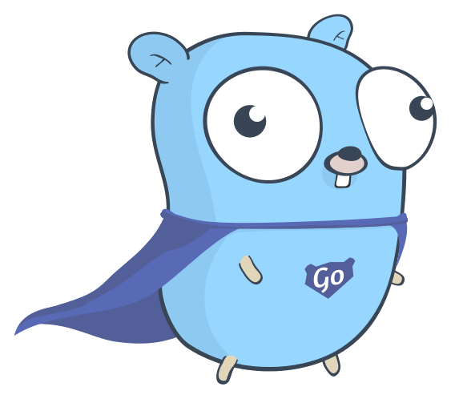

# fly-with-go

🐹 go is the language I want to 🛶 conquer next.

<p>
  
  
  
  
</p>

<h2 id="home">🏷️ contents</h2>

- #### [🛴 basic](#basic)

  - ##### [🖨️ printing](#printing)

  - ##### [🔫 function](#function)

  - ##### [🌳 variable](#variable)

  - ##### [🥚 basic types](#basic-types)

  - ##### [🍭 loop](#loop)

- #### [🚀 advanced](#advanced)

- #### [📙 documents](#documents)

- #### [🚧 license](#license)

<h2 id="basic">🛴 basic</h2>

<h4 id="printing">🖨️ printing</h4>

```go
package main

import (
  "fmt"
  "math"
)

func main() {
  fmt.Println("Hello %s", "🐹 Go")
  fmt.Println(math.Pi)
}
```

**[⬆️ back to top](#home)**

<h4 id="function">🔫 function</h4>

```go
package main

import "fmt"

func add(a int, b int) int {
  return a + b
}

func subtract(a, b int) int {
  return a - b
}

func swap(a, b int) (int, int) {
  return b, a
}

// named return values
func split(number int) (a, b int) {
	a = number / 10
	b = number % 10
	return
}

func main() {
  fmt.Println(add(6,9)) // 15
  fmt.Println(subtract(17, 10)) // 7
  a, b := swap(10, 17)
  fmt.Println(a, b) // 17 10
  fmt.Println(split(19)) // 1 9
}
```

**[⬆️ back to top](#home)**

<h4 id="variable">🌳 variable</h4>

```go
package main

import "fmt"

// global variables
var canFly bool
var age int = 21

func main() {
  // explict
  var name string = "Cuong Duy Tran Nguyen"
  // inferred
  var job, address = "Software Engineer", "Ho Chi Minh city"
  // shorthand
  gender := "male"
  // constant
  const homeTown = "Tam Ky city, Quang Nam province"
	fmt.Println(canFly, name, age, job, address, gender, homeTown)
}
```

**[⬆️ back to top](#home)**

<h4 id="basic-types">🥚 basic types</h4>

```
bool

string

int  int8  int16  int32  int64
uint uint8 uint16 uint32 uint64 uintptr

byte // alias for uint8

rune // alias for int32
     // represents a Unicode code point

float32 float64

complex64 complex128
```

```go
package main

import "fmt"

func main() {
	var (
		name string = "Cuong Duy Nguyen"
		age int = 21
	)
	fmt.Printf("type: %T, value: %v\n", name, name)
	fmt.Printf("type: %T, value: %v\n", age, age)
}
```

**[⬆️ back to top](#home)**

<h4 id="loop">🍭 loop</h4>

```go

```

<h2 id="advanced">🚀 advanced</h2>

<h2 id="documents">📙 documents</h2>

#### 🦊 [golang.org](https://golang.org/)

#### 🦌 [A Tour of Go](https://tour.golang.org)

#### 🐧 [Golang for Node.js Developers](https://github.com/miguelmota/golang-for-nodejs-developers)

#### 🐠 [Golang Tutorial  from zero to hero](https://milapneupane.com.np/2019/07/06/learning-golang-from-zero-to-hero/)

#### 🐳 [Go Cheat Sheet](https://github.com/a8m/golang-cheat-sheet)

**[⬆️ back to top](#home)**

<h2>🚧 license</h2>

MIT © [cuongw](https://github.com/cuongw)
